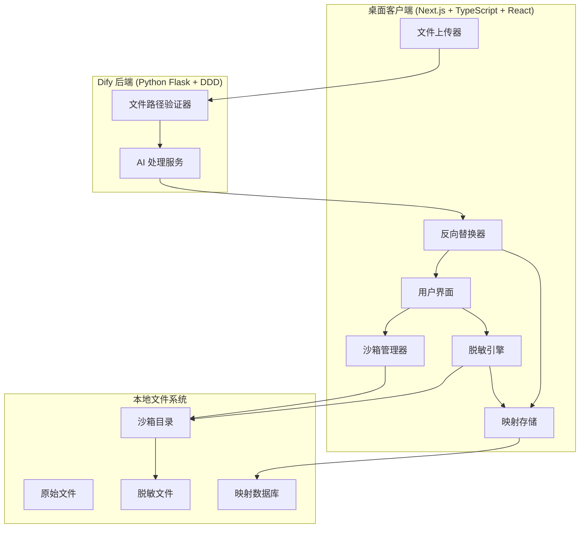
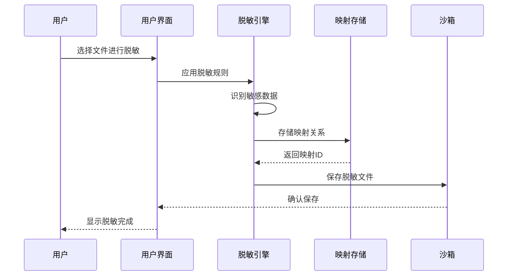
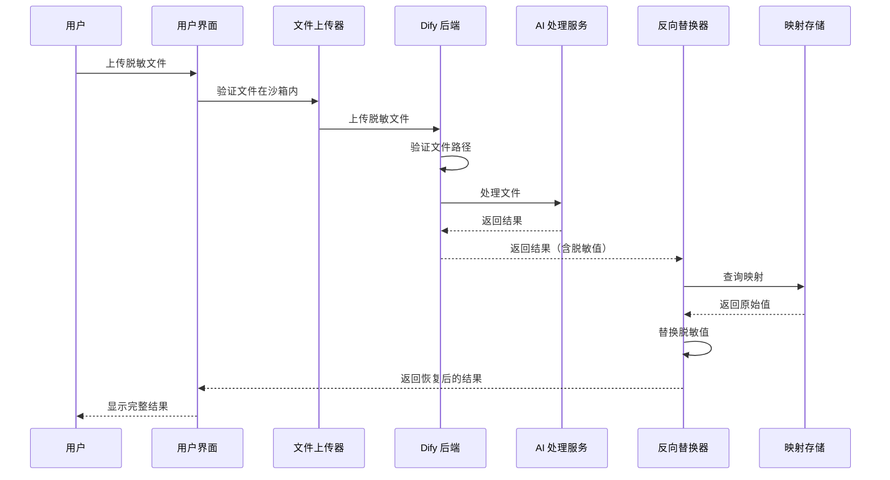

# 设计文档：数据脱敏功能

## 概述

数据脱敏功能是一个在桌面客户端实现的本地数据保护系统，允许用户在将文件上传到 Dify 后端进行 AI 处理之前对敏感信息进行脱敏。该系统由以下核心组件组成：

1. **脱敏引擎**：在前端实现的 TypeScript 模块，负责识别和替换敏感数据
2. **沙箱管理器**：管理本地隔离目录，存储脱敏文件和元数据
3. **映射存储**：本地加密存储，维护原始值与脱敏值的映射关系
4. **反向替换器**：在接收到 Dify 后端响应时恢复原始数据

该设计遵循以下原则：
- **隐私优先**：原始敏感数据永不离开本地环境
- **前端为主**：所有脱敏逻辑在桌面客户端实现
- **最小后端修改**：仅需 Dify 后端配合进行文件路径验证
- **用户控制**：用户完全控制脱敏规则和沙箱配置

## 架构

### 系统架构图



### 数据流

#### 脱敏流程



#### 上传和处理流程



## 组件和接口

### 1. 脱敏引擎 (MaskingEngine)

**职责**：
- 根据用户定义的规则识别敏感数据
- 将敏感数据替换为脱敏值
- 生成并存储映射关系

**接口**：

```typescript
interface MaskingEngine {
  /**
   * 对文件内容应用脱敏规则
   * @param content - 原始文件内容
   * @param rules - 要应用的脱敏规则数组
   * @returns 脱敏结果，包含脱敏后的内容和映射ID
   */
  maskContent(content: string, rules: MaskingRule[]): Promise<MaskingResult>;
  
  /**
   * 验证脱敏规则的有效性
   * @param rule - 要验证的脱敏规则
   * @returns 验证结果
   */
  validateRule(rule: MaskingRule): ValidationResult;
}

interface MaskingResult {
  maskedContent: string;
  mappingId: string;
  matchCount: number;
  timestamp: Date;
}

interface MaskingRule {
  id: string;
  name: string;
  pattern: string | RegExp;
  strategy: MaskingStrategy;
  enabled: boolean;
}

type MaskingStrategy = 
  | { type: 'replacement'; value: string }
  | { type: 'tokenization'; prefix: string }
  | { type: 'format-preserving'; format: string };

interface ValidationResult {
  valid: boolean;
  errors: string[];
}
```

**实现细节**：
- 使用正则表达式进行模式匹配
- 支持三种脱敏策略：
  - **替换（Replacement）**：用固定值替换（如 "***"）
  - **令牌化（Tokenization）**：生成唯一令牌（如 "TOKEN_001"）
  - **格式保留（Format-Preserving）**：保持原始格式（如电话号码保持数字格式）
- 按规则优先级顺序应用
- 记录每次匹配的位置和原始值

### 2. 沙箱管理器 (SandboxManager)

**职责**：
- 管理沙箱目录配置
- 验证文件路径是否在沙箱内
- 管理沙箱内的文件操作

**接口**：

```typescript
interface SandboxManager {
  /**
   * 配置沙箱路径
   * @param path - 沙箱目录路径
   * @returns 配置结果
   */
  configureSandbox(path: string): Promise<ConfigResult>;
  
  /**
   * 验证文件路径是否在沙箱内
   * @param filePath - 要验证的文件路径
   * @returns 验证结果
   */
  validatePath(filePath: string): boolean;
  
  /**
   * 在沙箱内保存文件
   * @param fileName - 文件名
   * @param content - 文件内容
   * @returns 保存的文件路径
   */
  saveFile(fileName: string, content: string): Promise<string>;
  
  /**
   * 从沙箱读取文件
   * @param filePath - 文件路径
   * @returns 文件内容
   */
  readFile(filePath: string): Promise<string>;
  
  /**
   * 列出沙箱内的文件
   * @returns 文件列表
   */
  listFiles(): Promise<FileInfo[]>;
  
  /**
   * 删除沙箱内的文件
   * @param filePath - 文件路径
   */
  deleteFile(filePath: string): Promise<void>;
}

interface ConfigResult {
  success: boolean;
  sandboxPath: string;
  error?: string;
}

interface FileInfo {
  name: string;
  path: string;
  size: number;
  createdAt: Date;
  isMasked: boolean;
}
```

**实现细节**：
- 使用 Node.js `fs` 模块进行文件操作
- 路径验证使用 `path.resolve()` 和 `path.relative()` 确保安全
- 沙箱配置存储在本地配置文件中（使用 `localStorage` 或配置文件）
- 支持相对路径和绝对路径
- 自动创建沙箱目录结构

### 3. 映射存储 (MappingStore)

**职责**：
- 存储和检索原始值与脱敏值的映射
- 加密敏感数据
- 管理映射的生命周期

**接口**：

```typescript
interface MappingStore {
  /**
   * 存储映射关系
   * @param mapping - 映射数据
   * @returns 映射ID
   */
  storeMapping(mapping: MappingData): Promise<string>;
  
  /**
   * 根据映射ID检索映射
   * @param mappingId - 映射ID
   * @returns 映射数据
   */
  getMapping(mappingId: string): Promise<MappingData | null>;
  
  /**
   * 根据脱敏值查找原始值
   * @param maskedValue - 脱敏值
   * @param mappingId - 映射ID
   * @returns 原始值
   */
  findOriginalValue(maskedValue: string, mappingId: string): Promise<string | null>;
  
  /**
   * 删除映射
   * @param mappingId - 映射ID
   */
  deleteMapping(mappingId: string): Promise<void>;
  
  /**
   * 列出所有映射
   * @returns 映射列表
   */
  listMappings(): Promise<MappingInfo[]>;
}

interface MappingData {
  id: string;
  fileName: string;
  entries: MappingEntry[];
  createdAt: Date;
  fileHash: string;
}

interface MappingEntry {
  originalValue: string;  // 加密存储
  maskedValue: string;
  position: number;
  ruleId: string;
}

interface MappingInfo {
  id: string;
  fileName: string;
  entryCount: number;
  createdAt: Date;
}
```

**实现细节**：
- 使用 SQLite 或 IndexedDB 作为本地数据库
- 原始值使用 AES-256 加密
- 加密密钥存储在操作系统的凭据管理系统中：
  - Windows: Credential Manager
  - macOS: Keychain
  - Linux: Secret Service API
- 支持批量查询以提高性能
- 实现 LRU 缓存以加速频繁访问的映射

### 4. 反向替换器 (ReverseSubstitution)

**职责**：
- 在 Dify 后端响应中识别脱敏值
- 查询映射存储获取原始值
- 替换脱敏值为原始值

**接口**：

```typescript
interface ReverseSubstitution {
  /**
   * 对响应数据执行反向替换
   * @param response - Dify 后端响应
   * @param mappingId - 映射ID
   * @returns 恢复后的响应
   */
  substitute(response: any, mappingId: string): Promise<any>;
  
  /**
   * 识别响应中的脱敏值
   * @param response - 响应数据
   * @returns 脱敏值列表
   */
  identifyMaskedValues(response: any): string[];
}
```

**实现细节**：
- 支持多种响应格式：
  - 纯文本
  - JSON 对象
  - 嵌套结构
- 递归遍历响应数据结构
- 使用正则表达式识别脱敏值模式
- 批量查询映射以减少数据库访问
- 处理部分替换失败的情况

### 5. 文件上传器 (FileUploader)

**职责**：
- 验证文件在沙箱内
- 上传文件到 Dify 后端
- 跟踪上传进度

**接口**：

```typescript
interface FileUploader {
  /**
   * 上传文件到 Dify 后端
   * @param filePath - 文件路径
   * @param mappingId - 关联的映射ID
   * @param onProgress - 进度回调
   * @returns 上传结果
   */
  uploadFile(
    filePath: string,
    mappingId: string,
    onProgress?: (progress: number) => void
  ): Promise<UploadResult>;
}

interface UploadResult {
  success: boolean;
  fileId: string;
  error?: string;
}
```

**实现细节**：
- 使用 Dify API 进行文件上传
- 在请求头中包含沙箱路径信息
- 支持大文件分块上传
- 实现重试机制
- 提供上传进度反馈

### 6. 用户界面组件

**主要页面**：

1. **脱敏规则管理页面**
   - 规则列表
   - 创建/编辑规则表单
   - 规则预览功能

2. **沙箱配置页面**
   - 沙箱路径选择器
   - 沙箱状态显示
   - 文件浏览器

3. **文件脱敏页面**
   - 文件选择器（限制在沙箱内）
   - 规则选择
   - 脱敏预览
   - 执行脱敏操作

4. **文件管理页面**
   - 脱敏文件列表
   - 上传功能
   - 删除功能

**UI 组件**：

```typescript
// 脱敏规则表单组件
interface MaskingRuleFormProps {
  rule?: MaskingRule;
  onSave: (rule: MaskingRule) => void;
  onCancel: () => void;
}

// 沙箱配置组件
interface SandboxConfigProps {
  currentPath: string;
  onPathChange: (path: string) => void;
}

// 文件脱敏组件
interface FileMaskingProps {
  sandboxPath: string;
  rules: MaskingRule[];
  onMaskComplete: (result: MaskingResult) => void;
}

// 文件列表组件
interface FileListProps {
  files: FileInfo[];
  onUpload: (filePath: string) => void;
  onDelete: (filePath: string) => void;
}
```

## 数据模型

### 脱敏规则 (MaskingRule)

```typescript
interface MaskingRule {
  id: string;                    // 唯一标识符
  name: string;                  // 规则名称
  description: string;           // 规则描述
  pattern: string | RegExp;      // 匹配模式
  strategy: MaskingStrategy;     // 脱敏策略
  enabled: boolean;              // 是否启用
  priority: number;              // 优先级（数字越小优先级越高）
  createdAt: Date;               // 创建时间
  updatedAt: Date;               // 更新时间
}
```

### 映射数据 (MappingData)

```typescript
interface MappingData {
  id: string;                    // 映射ID
  fileName: string;              // 关联的文件名
  filePath: string;              // 文件路径
  fileHash: string;              // 文件哈希（用于验证）
  entries: MappingEntry[];       // 映射条目
  createdAt: Date;               // 创建时间
  expiresAt?: Date;              // 过期时间（可选）
}

interface MappingEntry {
  originalValue: string;         // 原始值（加密存储）
  maskedValue: string;           // 脱敏值
  position: number;              // 在文件中的位置
  ruleId: string;                // 应用的规则ID
  context?: string;              // 上下文信息（可选）
}
```

### 沙箱配置 (SandboxConfig)

```typescript
interface SandboxConfig {
  path: string;                  // 沙箱路径
  createdAt: Date;               // 创建时间
  lastModified: Date;            // 最后修改时间
  maxSize?: number;              // 最大大小限制（字节）
  autoCleanup: boolean;          // 是否自动清理
  cleanupDays?: number;          // 清理天数
}
```

### 脱敏日志 (MaskingLog)

```typescript
interface MaskingLog {
  id: string;                    // 日志ID
  operation: 'mask' | 'upload' | 'substitute' | 'delete';
  fileName: string;              // 文件名
  mappingId?: string;            // 关联的映射ID
  status: 'success' | 'failure' | 'partial';
  message: string;               // 日志消息
  timestamp: Date;               // 时间戳
  details?: any;                 // 详细信息（可选）
}
```

## 数据库架构

使用 SQLite 作为本地数据库，包含以下表：

### masking_rules 表

```sql
CREATE TABLE masking_rules (
  id TEXT PRIMARY KEY,
  name TEXT NOT NULL,
  description TEXT,
  pattern TEXT NOT NULL,
  strategy_type TEXT NOT NULL,
  strategy_config TEXT NOT NULL,
  enabled INTEGER NOT NULL DEFAULT 1,
  priority INTEGER NOT NULL DEFAULT 0,
  created_at TEXT NOT NULL,
  updated_at TEXT NOT NULL
);
```

### mappings 表

```sql
CREATE TABLE mappings (
  id TEXT PRIMARY KEY,
  file_name TEXT NOT NULL,
  file_path TEXT NOT NULL,
  file_hash TEXT NOT NULL,
  created_at TEXT NOT NULL,
  expires_at TEXT,
  INDEX idx_file_hash (file_hash)
);
```

### mapping_entries 表

```sql
CREATE TABLE mapping_entries (
  id INTEGER PRIMARY KEY AUTOINCREMENT,
  mapping_id TEXT NOT NULL,
  original_value_encrypted TEXT NOT NULL,
  masked_value TEXT NOT NULL,
  position INTEGER NOT NULL,
  rule_id TEXT NOT NULL,
  context TEXT,
  FOREIGN KEY (mapping_id) REFERENCES mappings(id) ON DELETE CASCADE,
  INDEX idx_mapping_id (mapping_id),
  INDEX idx_masked_value (masked_value)
);
```

### sandbox_config 表

```sql
CREATE TABLE sandbox_config (
  id INTEGER PRIMARY KEY CHECK (id = 1),
  path TEXT NOT NULL,
  created_at TEXT NOT NULL,
  last_modified TEXT NOT NULL,
  max_size INTEGER,
  auto_cleanup INTEGER NOT NULL DEFAULT 0,
  cleanup_days INTEGER
);
```

### masking_logs 表

```sql
CREATE TABLE masking_logs (
  id TEXT PRIMARY KEY,
  operation TEXT NOT NULL,
  file_name TEXT NOT NULL,
  mapping_id TEXT,
  status TEXT NOT NULL,
  message TEXT NOT NULL,
  timestamp TEXT NOT NULL,
  details TEXT,
  INDEX idx_timestamp (timestamp),
  INDEX idx_operation (operation)
);
```

## 正确性属性

属性是一个特征或行为，应该在系统的所有有效执行中保持为真——本质上是关于系统应该做什么的正式陈述。属性作为人类可读规范和机器可验证正确性保证之间的桥梁。

### 属性 1：脱敏规则完整应用

*对于任何*文件内容和任何启用的脱敏规则集，当执行脱敏操作时，所有启用的规则都应该被应用于内容，并且映射存储应该包含所有匹配项的映射条目。

**验证：需求 1.1, 1.3**

### 属性 2：沙箱文件保存

*对于任何*脱敏操作，生成的脱敏文件应该保存在用户配置的沙箱路径内，并且文件路径应该可以通过沙箱路径验证。

**验证：需求 1.4**

### 属性 3：规则持久化往返

*对于任何*有效的脱敏规则，保存规则然后检索规则应该返回等价的规则配置（包括所有字段：名称、模式、策略、优先级等）。

**验证：需求 2.3**

### 属性 4：规则更新生效

*对于任何*已存在的脱敏规则，当规则被编辑并保存后，后续的脱敏操作应该使用更新后的规则配置，而不是原始配置。

**验证：需求 2.4**

### 属性 5：规则删除生效

*对于任何*脱敏规则，当规则被删除后，后续的脱敏操作不应该应用该规则，并且规则不应该出现在活动规则列表中。

**验证：需求 2.5**

### 属性 6：沙箱路径验证

*对于任何*路径字符串，沙箱路径验证应该正确识别路径是否存在、是否可写，并且只有满足这两个条件的路径才能被设置为沙箱路径。

**验证：需求 3.1**

### 属性 7：沙箱配置持久化

*对于任何*有效的沙箱路径，设置沙箱路径后重启应用程序，沙箱路径配置应该保持不变。

**验证：需求 3.2**

### 属性 8：沙箱边界强制

*对于任何*文件操作（读取、写入、删除、上传），操作应该只能在配置的沙箱路径内执行，任何尝试访问沙箱外路径的操作都应该被拒绝。

**验证：需求 3.3, 3.4, 3.5, 3.6, 4.1**

### 属性 9：只传输脱敏数据

*对于任何*文件上传操作，传输到 Dify 后端的数据应该只包含脱敏值，不应该包含任何原始敏感数据。

**验证：需求 4.2, 9.2**

### 属性 10：映射唯一标识

*对于任何*脱敏操作创建的映射，映射应该有唯一的标识符，并且可以通过该标识符检索到完整的映射数据。

**验证：需求 5.1**

### 属性 11：原始值加密存储

*对于任何*存储在映射数据库中的原始敏感值，该值应该以加密形式存储，直接读取数据库不应该能看到明文原始值。

**验证：需求 5.2, 9.1**

### 属性 12：映射关联上传

*对于任何*脱敏文件上传操作，上传请求应该包含关联的映射标识符，以便后续反向替换可以找到正确的映射。

**验证：需求 5.3**

### 属性 13：映射查询隔离

*对于任何*映射查询操作，查询结果应该只包含与指定文件或映射ID关联的映射条目，不应该返回其他文件的映射。

**验证：需求 5.4**

### 属性 14：脱敏值反向查找

*对于任何*脱敏值和关联的映射ID，应该能够通过脱敏值查找到对应的原始值。

**验证：需求 5.5**

### 属性 15：脱敏和反向替换往返

*对于任何*文件内容和脱敏规则集，执行脱敏操作然后对结果执行反向替换，应该恢复出与原始内容等价的内容（所有敏感数据被正确恢复）。

**验证：需求 6.1, 6.2, 6.3, 6.4**

### 属性 16：多格式反向替换

*对于任何*支持的响应格式（文本、JSON、结构化数据），反向替换应该能够正确识别和替换该格式中的脱敏值。

**验证：需求 6.6**

### 属性 17：日志不含敏感数据

*对于任何*脱敏操作生成的日志条目，日志内容不应该包含原始敏感值，只应该包含脱敏值或操作元数据。

**验证：需求 9.4**

## 错误处理

### 错误类型和处理策略

#### 1. 脱敏操作错误

**错误场景**：
- 文件读取失败
- 规则应用失败（无效正则表达式）
- 映射存储失败

**处理策略**：
- 保留原始文件不变
- 回滚所有部分完成的操作
- 记录详细错误信息到日志
- 向用户显示友好的错误消息
- 提供重试选项

**实现**：
```typescript
class MaskingError extends Error {
  constructor(
    message: string,
    public code: string,
    public details?: any
  ) {
    super(message);
    this.name = 'MaskingError';
  }
}

async function maskContentWithErrorHandling(
  content: string,
  rules: MaskingRule[]
): Promise<MaskingResult> {
  try {
    // 执行脱敏
    const result = await maskContent(content, rules);
    return result;
  } catch (error) {
    // 回滚操作
    await rollbackMaskingOperation();
    
    // 记录错误
    await logError({
      operation: 'mask',
      error: error.message,
      timestamp: new Date()
    });
    
    // 抛出友好错误
    throw new MaskingError(
      '脱敏操作失败，原始文件已保留',
      'MASKING_FAILED',
      { originalError: error }
    );
  }
}
```

#### 2. 沙箱配置错误

**错误场景**：
- 路径不存在
- 路径不可写
- 路径在系统保护目录中

**处理策略**：
- 拒绝无效配置
- 提供具体的错误原因
- 建议有效的替代路径
- 保持之前的有效配置

**实现**：
```typescript
async function validateSandboxPath(path: string): Promise<ValidationResult> {
  // 检查路径存在
  if (!fs.existsSync(path)) {
    return {
      valid: false,
      errors: ['路径不存在，请选择一个存在的目录']
    };
  }
  
  // 检查可写权限
  try {
    fs.accessSync(path, fs.constants.W_OK);
  } catch {
    return {
      valid: false,
      errors: ['路径不可写，请选择一个有写入权限的目录']
    };
  }
  
  // 检查是否在系统保护目录
  const protectedPaths = ['/System', 'C:\\Windows', '/usr', '/bin'];
  if (protectedPaths.some(p => path.startsWith(p))) {
    return {
      valid: false,
      errors: ['不能使用系统保护目录作为沙箱']
    };
  }
  
  return { valid: true, errors: [] };
}
```

#### 3. 文件上传错误

**错误场景**：
- 网络连接失败
- 服务器拒绝请求
- 文件大小超限
- 认证失败

**处理策略**：
- 保留脱敏文件和映射数据
- 实现自动重试机制（指数退避）
- 提供手动重试选项
- 显示详细的错误信息

**实现**：
```typescript
async function uploadFileWithRetry(
  filePath: string,
  mappingId: string,
  maxRetries: number = 3
): Promise<UploadResult> {
  let lastError: Error;
  
  for (let attempt = 0; attempt < maxRetries; attempt++) {
    try {
      const result = await uploadFile(filePath, mappingId);
      return result;
    } catch (error) {
      lastError = error;
      
      // 记录重试
      await logError({
        operation: 'upload',
        attempt: attempt + 1,
        error: error.message
      });
      
      // 指数退避
      if (attempt < maxRetries - 1) {
        await sleep(Math.pow(2, attempt) * 1000);
      }
    }
  }
  
  // 所有重试失败
  throw new UploadError(
    `文件上传失败（已重试 ${maxRetries} 次）`,
    'UPLOAD_FAILED',
    { originalError: lastError }
  );
}
```

#### 4. 反向替换错误

**错误场景**：
- 映射数据缺失
- 映射数据损坏
- 响应格式不支持

**处理策略**：
- 执行部分替换（替换能找到映射的值）
- 记录缺失的映射
- 向用户报告哪些值未能恢复
- 提供查看原始响应的选项

**实现**：
```typescript
async function substituteWithPartialFailure(
  response: any,
  mappingId: string
): Promise<SubstitutionResult> {
  const maskedValues = identifyMaskedValues(response);
  const substituted: string[] = [];
  const failed: string[] = [];
  
  for (const maskedValue of maskedValues) {
    try {
      const originalValue = await findOriginalValue(maskedValue, mappingId);
      if (originalValue) {
        response = replaceValue(response, maskedValue, originalValue);
        substituted.push(maskedValue);
      } else {
        failed.push(maskedValue);
      }
    } catch (error) {
      failed.push(maskedValue);
      await logWarning({
        operation: 'substitute',
        maskedValue,
        error: error.message
      });
    }
  }
  
  return {
    response,
    substituted,
    failed,
    partial: failed.length > 0
  };
}
```

### 错误恢复机制

#### 事务性操作

对于关键操作（如脱敏），实现事务性保证：

```typescript
class TransactionManager {
  private operations: Array<() => Promise<void>> = [];
  
  async execute<T>(operation: () => Promise<T>): Promise<T> {
    const rollbackOps: Array<() => Promise<void>> = [];
    
    try {
      const result = await operation();
      return result;
    } catch (error) {
      // 执行回滚
      for (const rollback of rollbackOps.reverse()) {
        try {
          await rollback();
        } catch (rollbackError) {
          console.error('回滚失败:', rollbackError);
        }
      }
      throw error;
    }
  }
  
  addRollback(rollback: () => Promise<void>): void {
    this.operations.push(rollback);
  }
}
```

#### 操作日志

维护详细的操作日志以支持故障排除：

```typescript
interface OperationLog {
  id: string;
  operation: string;
  status: 'started' | 'completed' | 'failed';
  timestamp: Date;
  details: any;
  error?: string;
}

async function logOperation(log: OperationLog): Promise<void> {
  await db.insert('masking_logs', log);
}
```

## 测试策略

### 双重测试方法

本系统采用单元测试和基于属性的测试相结合的方法：

- **单元测试**：验证特定示例、边缘情况和错误条件
- **属性测试**：通过随机生成的输入验证通用属性

两者是互补的，对于全面覆盖都是必要的。

### 单元测试

单元测试专注于：
- 特定示例，演示正确行为
- 组件之间的集成点
- 边缘情况和错误条件

**示例**：
```typescript
describe('MaskingEngine', () => {
  it('should mask email addresses', () => {
    const content = 'Contact: user@example.com';
    const rule: MaskingRule = {
      id: '1',
      name: 'Email',
      pattern: /\b[\w.-]+@[\w.-]+\.\w+\b/g,
      strategy: { type: 'replacement', value: '***@***.***' },
      enabled: true,
      priority: 0
    };
    
    const result = maskContent(content, [rule]);
    
    expect(result.maskedContent).toBe('Contact: ***@***.***');
    expect(result.matchCount).toBe(1);
  });
  
  it('should handle empty content', () => {
    const result = maskContent('', []);
    expect(result.maskedContent).toBe('');
    expect(result.matchCount).toBe(0);
  });
});
```

### 基于属性的测试

基于属性的测试验证通用属性在所有输入中都成立。

**配置**：
- 使用 `fast-check` 库（TypeScript 的属性测试库）
- 每个属性测试最少运行 100 次迭代
- 每个测试必须引用设计文档中的属性

**示例**：
```typescript
import * as fc from 'fast-check';

describe('Property Tests', () => {
  /**
   * Feature: data-masking, Property 15: 脱敏和反向替换往返
   * 
   * 对于任何文件内容和脱敏规则集，执行脱敏操作然后对结果执行反向替换，
   * 应该恢复出与原始内容等价的内容。
   */
  it('should preserve content through mask and substitute round trip', () => {
    fc.assert(
      fc.property(
        fc.string(),  // 随机生成内容
        fc.array(arbitraryMaskingRule()),  // 随机生成规则
        async (content, rules) => {
          // 执行脱敏
          const maskResult = await maskContent(content, rules);
          
          // 存储映射
          const mappingId = await storeMapping({
            fileName: 'test.txt',
            entries: maskResult.entries,
            createdAt: new Date(),
            fileHash: hash(content)
          });
          
          // 执行反向替换
          const substituteResult = await substitute(
            maskResult.maskedContent,
            mappingId
          );
          
          // 验证往返
          expect(substituteResult).toBe(content);
        }
      ),
      { numRuns: 100 }
    );
  });
  
  /**
   * Feature: data-masking, Property 8: 沙箱边界强制
   * 
   * 对于任何文件操作，操作应该只能在配置的沙箱路径内执行。
   */
  it('should enforce sandbox boundaries for all file operations', () => {
    fc.assert(
      fc.property(
        fc.string(),  // 随机文件路径
        async (filePath) => {
          const sandboxPath = '/sandbox';
          const manager = new SandboxManager(sandboxPath);
          
          const isInSandbox = filePath.startsWith(sandboxPath);
          const canOperate = manager.validatePath(filePath);
          
          // 只有沙箱内的路径才能操作
          expect(canOperate).toBe(isInSandbox);
        }
      ),
      { numRuns: 100 }
    );
  });
});

// 自定义生成器
function arbitraryMaskingRule(): fc.Arbitrary<MaskingRule> {
  return fc.record({
    id: fc.uuid(),
    name: fc.string(),
    pattern: fc.oneof(
      fc.constant(/\b[\w.-]+@[\w.-]+\.\w+\b/g),  // Email
      fc.constant(/\d{3}-\d{4}-\d{4}/g),         // Phone
      fc.constant(/\d{16}/g)                      // Credit card
    ),
    strategy: fc.oneof(
      fc.record({ type: fc.constant('replacement'), value: fc.string() }),
      fc.record({ type: fc.constant('tokenization'), prefix: fc.string() })
    ),
    enabled: fc.boolean(),
    priority: fc.integer({ min: 0, max: 10 })
  });
}
```

### 测试覆盖目标

- **单元测试覆盖率**：> 80%
- **属性测试**：所有设计文档中的属性都有对应的测试
- **集成测试**：覆盖主要用户流程
- **边缘情况**：大文件、特殊字符、并发操作

### 测试工具

- **单元测试框架**：Jest
- **属性测试库**：fast-check
- **测试覆盖率**：Jest coverage
- **E2E 测试**：Playwright（用于 UI 测试）

## 安全考虑

### 1. 数据加密

- **静态加密**：所有原始敏感值使用 AES-256-GCM 加密
- **密钥管理**：使用操作系统凭据管理系统
- **密钥轮换**：支持定期更换加密密钥

### 2. 内存安全

- **敏感数据清除**：操作完成后立即清除内存中的敏感数据
- **安全字符串**：使用 `SecureString` 类型处理敏感数据
- **避免日志泄露**：确保日志不包含敏感信息

### 3. 网络安全

- **HTTPS 传输**：所有与 Dify 后端的通信使用 HTTPS
- **数据验证**：验证上传的数据不包含原始敏感值
- **请求签名**：使用 HMAC 签名验证请求完整性

### 4. 文件系统安全

- **路径验证**：严格验证所有文件路径
- **权限检查**：验证文件操作权限
- **沙箱隔离**：强制执行沙箱边界

### 5. 审计日志

- **操作记录**：记录所有关键操作
- **访问日志**：记录文件访问尝试
- **错误日志**：记录所有错误和异常

## 性能优化

### 1. 脱敏性能

- **流式处理**：对大文件使用流式处理
- **并行处理**：多个规则并行应用
- **缓存编译的正则表达式**：避免重复编译

### 2. 映射存储性能

- **索引优化**：在 `masked_value` 和 `mapping_id` 上创建索引
- **批量操作**：使用批量插入和查询
- **LRU 缓存**：缓存频繁访问的映射

### 3. UI 响应性

- **异步操作**：所有 I/O 操作异步执行
- **进度反馈**：长时间操作显示进度
- **虚拟滚动**：大列表使用虚拟滚动

## 部署考虑

### 桌面应用打包

- **Electron**：使用 Electron 打包为桌面应用
- **平台支持**：Windows、macOS、Linux
- **自动更新**：支持应用自动更新

### 数据库初始化

- **自动迁移**：应用启动时自动创建/更新数据库架构
- **数据备份**：提供数据导出和导入功能

### 配置管理

- **用户配置**：存储在用户目录
- **默认配置**：提供合理的默认值
- **配置验证**：启动时验证配置有效性

## 国际化

- **多语言支持**：使用 `web/i18n/en-US/` 和 `web/i18n/zh-CN/`
- **动态切换**：支持运行时切换语言
- **翻译键**：所有用户界面文本使用翻译键

**示例**：
```typescript
// web/i18n/zh-CN/data-masking.ts
export default {
  'data-masking.title': '数据脱敏',
  'data-masking.rules.create': '创建规则',
  'data-masking.sandbox.configure': '配置沙箱',
  'data-masking.file.mask': '脱敏文件',
  'data-masking.file.upload': '上传文件',
  'data-masking.error.mask-failed': '脱敏操作失败',
  'data-masking.error.upload-failed': '文件上传失败'
};
```

## 未来扩展

### 可能的增强功能

1. **高级脱敏策略**
   - 差分隐私
   - 同态加密
   - 安全多方计算

2. **协作功能**
   - 共享脱敏规则
   - 团队沙箱
   - 审批工作流

3. **AI 辅助**
   - 自动识别敏感数据
   - 智能规则推荐
   - 异常检测

4. **集成扩展**
   - 支持更多云平台
   - API 集成
   - 插件系统

5. **合规性**
   - GDPR 合规报告
   - 数据保留策略
   - 审计报告生成
